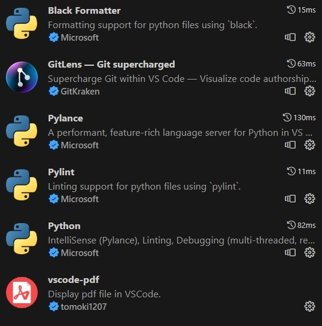

# Python fejlesztői környezet beállítása VS Code programmal
## 1. Python értelmező letöltése és telepítése
>[Link a letöltéshez](https://www.python.org/downloads/)
## 2. VS Code User Installer - letöltése és telepítése
>[Link a letöltéshez](https://code.visualstudio.com/Download)

Utolsó lépésnél legyen mind az öt kapcsolónégyzet kipipálva:

## 3. VS Code bővítmények telepítése
A következő képen látható bővítményeket keressed meg és telepítsed őket a VS Code-hoz:

## 4. Beállítások másolása

>Indítsad el a start.bat állományt a "Python-config" mappából!